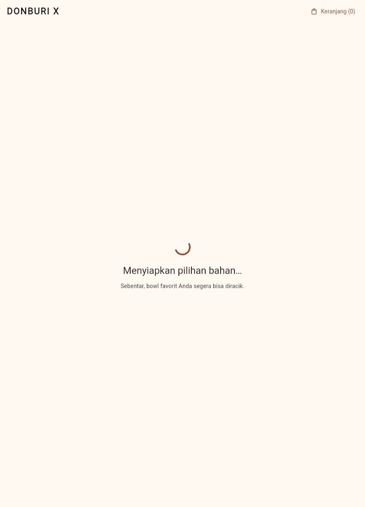
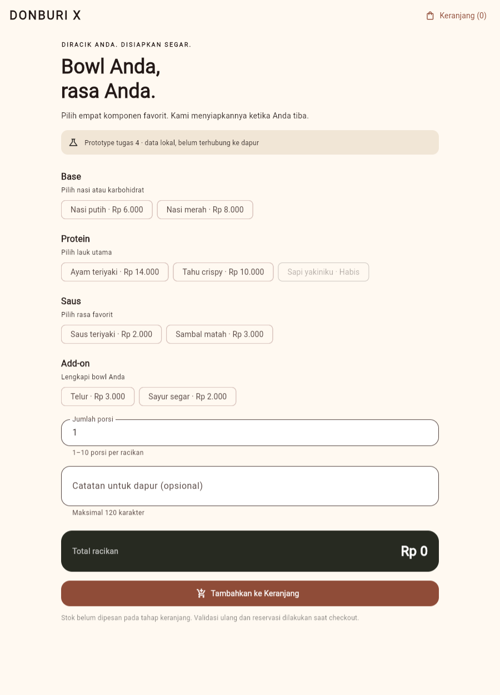
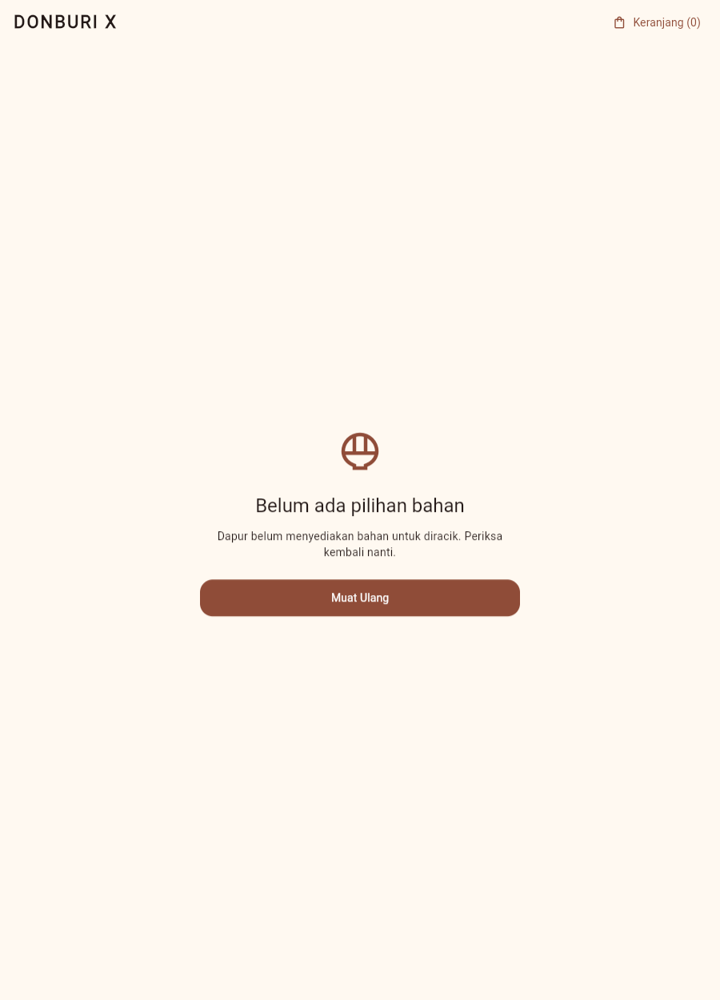
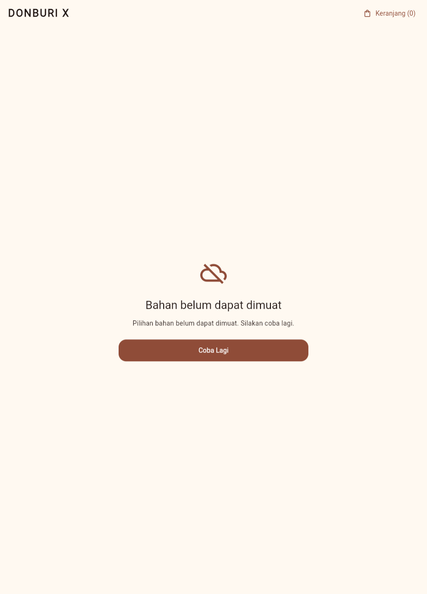
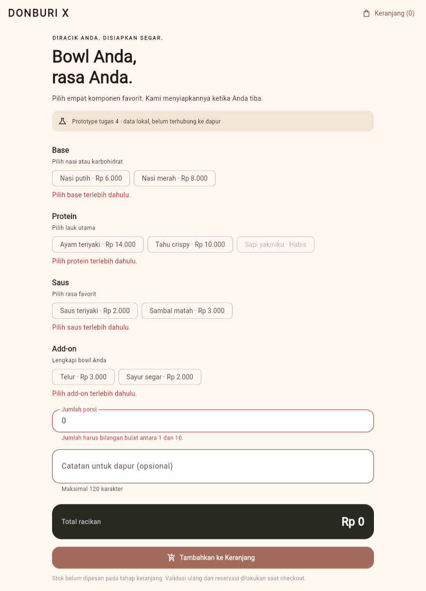
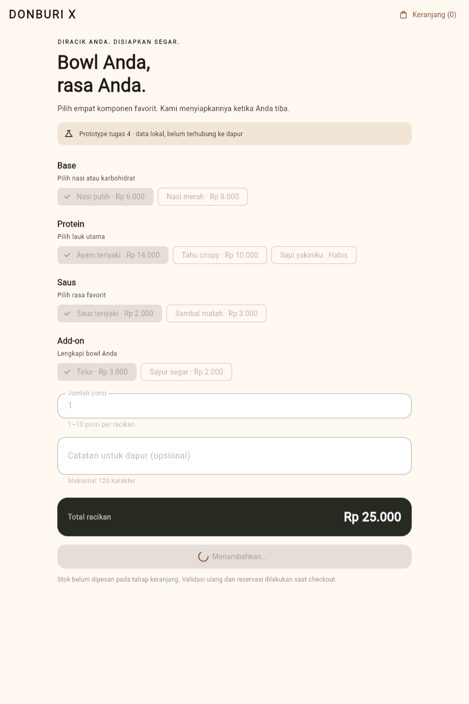
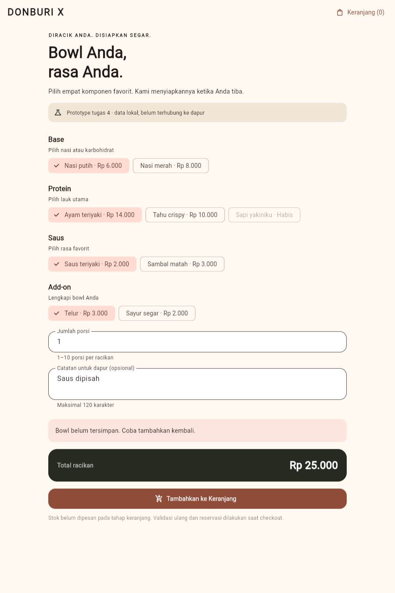
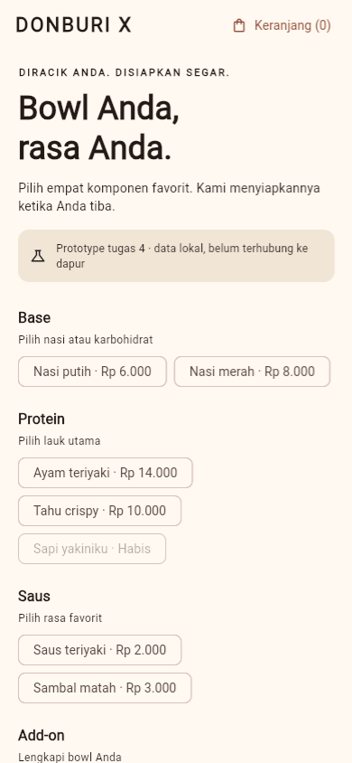

# Tugas 4 — Bowl Builder DonburiX

## 1. Feature yang Dikumpulkan

Feature **Racik Bowl** merupakan bagian Dynamic Bowl Builder pada README DonburiX.
Pelanggan memilih satu base, protein, saus, dan add-on, mengisi jumlah porsi serta catatan,
lalu menyimpan racikan ke keranjang lokal yang dapat dibuka dari app bar.

Implementasi memakai **Flutter + Riverpod**. Tidak ada backend produksi pada tugas ini.
Repository lokal memungkinkan demonstrasi state asynchronous yang dapat direproduksi tanpa koneksi Firebase.
Label prototype pada aplikasi menjelaskan batas tersebut.

## 2. Pemetaan Instruksi Dosen

| Instruksi | Implementasi | Bukti |
| --- | --- | --- |
| Initial loading | `AsyncLoading` saat katalog belum selesai | Screenshot 01; widget test initial loading |
| Data berhasil dimuat | Form racikan dari katalog `AsyncData` | Screenshot 02; test loaded dan perhitungan harga |
| Empty state | `AsyncData([])` tanpa form submit | Screenshot 03; test empty catalog |
| Error dengan retry | `AsyncError`, pesan, tombol Coba Lagi | Screenshot 04; test error lalu retry berhasil |
| Validasi form | Pilihan wajib, batas jumlah, stok, panjang catatan | Screenshot 05; test invalid input |
| Loading submit dan cegah double tap | `isSubmitting`, tombol dan input nonaktif, guard notifier | Screenshot 06; test double tap dan reentrancy |
| State management konsisten | Semua state data/bisnis melalui Riverpod | `bowl_providers.dart` |
| Pisahkan tanggung jawab | Presentation → notifier → repository | Struktur feature pada bagian 3 |
| Widget test state utama dan edge case | 18 widget test | `bowl_builder_widget_test.dart` |
| Dokumentasi visual | 9 screenshot render Flutter Web | Folder `screenshots/` |
| Cantumkan penggunaan AI | Prompt asli, kontribusi AI, dan template refleksi mahasiswa | [AI_USAGE.md](AI_USAGE.md) |

## 3. Pemisahan Tanggung Jawab

```text
apps/mobile/lib/features/bowl_builder/
├── domain/
│   ├── bowl_models.dart
│   ├── bowl_repository.dart
│   └── bowl_validation.dart
├── data/
│   └── demo_bowl_repository.dart
├── state/
│   └── bowl_providers.dart
└── presentation/
    ├── bowl_builder_screen.dart
    └── widgets/
        ├── ingredient_field.dart
        └── feature_message.dart
```

* **Widget:** menampilkan state, menerima input, menjalankan `Form.validate()`, dan meneruskan aksi ke notifier.
* **Notifier:** mengelola pilihan, jumlah, catatan, status submit, hasil, serta snapshot keranjang; memvalidasi draft sebelum repository dipanggil.
* **Repository:** menyediakan katalog dan menyimpan racikan; implementasi demo memakai harga katalog sendiri, bukan harga dari caller.
* **Domain:** model immutable dan aturan validasi yang dipakai form serta notifier/repository.

`GlobalKey<FormState>` merupakan state teknis form, bukan tempat menyimpan aturan bisnis atau data keranjang.

### Provider

| Provider | Tugas |
| --- | --- |
| `bowlRepositoryProvider` | Dependency injection; dapat dioverride pada test atau integrasi API |
| `ingredientCatalogProvider` | `AsyncNotifier` untuk load, data, empty, dan error katalog |
| `bowlBuilderProvider` | `Notifier` untuk draft dan submit asynchronous |
| `bowlTotalProvider` | Derived state; total berubah saat bahan atau jumlah berubah |

Retry katalog memakai `ref.invalidate(ingredientCatalogProvider)`.
Automatic retry dinonaktifkan pada provider agar error tetap terlihat sampai pengguna menekan Coba Lagi.
Submit tidak mengganti katalog menjadi loading; form tetap terlihat dengan input yang terkunci.

## 4. Aturan Form

* Tepat satu bahan pada setiap kategori wajib dipilih.
* Bahan dengan stok nol tidak dapat dipilih.
* Jumlah harus bilangan bulat dari 1 sampai 10.
* Jumlah tidak dapat melebihi stok salah satu bahan terpilih.
* Catatan opsional; maksimal 120 karakter setelah whitespace di awal/akhir dibuang.
* Draft invalid tidak memanggil `addToCart`.
* Harga dihitung sebagai jumlah harga komponen dikali jumlah porsi.

Contoh: nasi Rp 6.000 + ayam Rp 14.000 + saus Rp 2.000 + telur Rp 3.000 = **Rp 25.000**.
Dua porsi menjadi **Rp 50.000**.

### Pencegahan double tap

1. Widget menonaktifkan tombol ketika `isSubmitting` bernilai true.
2. Notifier juga menolak `submit()` baru selama proses berjalan, termasuk panggilan sebelum widget sempat rebuild.
3. Pilihan dan input dikunci agar draft tidak berubah selama proses.
4. State hasil hanya diubah jika provider masih mounted setelah `await`.
5. Jika gagal, input dipertahankan, keranjang tidak bertambah, dan pengguna dapat mencoba kembali.

Guard ini mencegah submit ganda dalam satu sesi client.
Integrasi checkout backend tetap memerlukan idempotency untuk pengiriman ulang lintas koneksi atau sesi.

## 5. Menjalankan dan Mendemonstrasikan

Dari root repository, buka terminal pada `apps/mobile`, lalu jalankan:

```sh
flutter pub get
flutter run -d chrome
```

Gunakan URL yang dicetak Flutter, lalu tambahkan query berikut jika diperlukan:

| Scenario | Langkah demonstrasi |
| --- | --- |
| `?scenario=loading` | Lihat spinner dan pesan initial loading |
| `?scenario=success` | Tunggu katalog tampil, pilih bahan, ubah jumlah |
| `?scenario=empty` | Lihat empty state dan tombol Muat Ulang |
| `?scenario=error` | Lihat error, tekan Coba Lagi, tunggu form tampil |
| `?scenario=submit` | Pilih empat bahan dan tekan tambah; loading berlangsung lima detik |
| `?scenario=submit-error` | Submit pertama gagal; input tetap ada; submit kedua berhasil |

Query hanya merupakan kontrol demonstrasi pada repository lokal, bukan mekanisme memilih data produksi.
Pada Android, gunakan `--dart-define=DEMO_SCENARIO=<scenario>`.
Masukkan `0` atau `11` untuk validasi jumlah; pilih tahu dan jumlah `7` untuk validasi stok.

## 6. Hasil Verifikasi

Lingkungan verifikasi: Flutter **3.44.1**, Dart **3.12.1**, Riverpod **3.4.3**, Windows.

| Pemeriksaan | Hasil lokal |
| --- | --- |
| `flutter analyze` | Lulus, `No issues found!` |
| `flutter test --coverage` | Lulus, **20 test**: 18 widget dan 2 domain/repository |
| Line coverage pada file yang dilaporkan LCOV | **280/292 baris, 95,9%** |
| `flutter build web` | Build release berhasil pada implementasi awal |
| Browser QA | Retry load, validasi, submit, retry submit, dan membuka keranjang berhasil |
| Console browser | Tidak ditemukan error pada sesi QA |
| Tampilan sempit | Widget test viewport 390×844 lulus; screenshot mobile tersedia |

Coverage di atas adalah line coverage dari `coverage/lcov.info`, bukan branch coverage.
Entry point `main.dart` tidak dimasukkan oleh pengujian widget yang memulai aplikasi dari `DonburiXApp`.
Scenario demo juga diperiksa melalui browser, bukan semuanya melalui unit test.

Build web mengeluarkan pemberitahuan optimasi font dari Flutter, tetapi menghasilkan `build/web` dengan sukses.
Build APK dan pengujian perangkat Android belum dijalankan pada sesi ini.
Workflow `.github/workflows/flutter.yml` disiapkan untuk analyze, test, dan build; hasil CI baru tersedia setelah dijalankan di GitHub.

### Daftar test

1. Initial loading menampilkan spinner tanpa form.
2. Data tersedia; pilihan bahan dan perubahan jumlah menghitung total yang benar.
3. Katalog kosong menampilkan empty state.
4. Error load menampilkan retry dan pulih setelah retry.
5. Pilihan wajib kosong menghasilkan error dan tidak melakukan submit.
6. Jumlah kosong, nol, lebih dari batas, desimal, dan teks ditolak.
7. Catatan lebih dari batas ditolak.
8. Bahan habis tidak dapat dipilih.
9. Jumlah melebihi stok bahan ditolak.
10. Submit mengunci input, menolak double tap/reentrancy, dan menambah tepat satu entry keranjang.
11. Submit gagal mempertahankan input dan mengizinkan percobaan baru.
12. Layar mobile sempit tidak menghasilkan layout exception.
13. Repository menghitung ulang harga dari katalog, bukan harga yang dikirim caller.
14. Domain menolak kategori duplikat dan stok yang tidak mencukupi.
15. Jumlah tepat 1 porsi diterima dan menambahkan satu porsi ke keranjang.
16. Jumlah tepat 10 porsi diterima jika stok mencukupi; harga total dan isi keranjang sesuai.
17. Catatan tepat 120 karakter diterima dan tetap tersimpan pada entry keranjang.
18. Error submit yang tidak terduga menghentikan loading, mengaktifkan form, dan dapat dipulihkan melalui retry.
19. Hasil submit sukses setelah `ProviderScope` dilepas tidak menyebabkan exception atau feedback pada widget yang sudah ditutup.
20. Hasil submit gagal setelah `ProviderScope` dilepas tidak menyebabkan exception atau feedback pada widget yang sudah ditutup.

Test memakai controlled repository dan `Completer`, sehingga tidak mengandalkan network atau menunggu delay produksi.
Unit test repository demo memakai delay lokal yang memang menjadi bagian implementasi tersebut.
Enam test terakhir ditambahkan pada tahap penyempurnaan P4. Detail perubahan tersedia pada [catatan progres](PROGRESS.md).

## 7. Bukti Visual

### Initial loading


### Data berhasil dimuat


### Empty state


### Error dengan retry


### Validasi form


### Loading submit


### Submit berhasil


### Submit gagal, input dipertahankan


### Viewport mobile


Screenshot berasal dari Flutter Web release yang dirender di browser.
Gambar mobile merupakan viewport browser, bukan klaim pengujian native Android.

## 8. Panduan Penjelasan Saat Presentasi

* Jelaskan mengapa initial loading/error katalog berbeda dari loading/error submit.
* Tunjukkan bahwa repository tidak dipanggil ketika form invalid.
* Tunjukkan dua lapisan guard double tap: tombol dan notifier.
* Jelaskan provider override pada test serta penggunaan `Completer` untuk menahan asynchronous operation.
* Tunjukkan perubahan total harga saat jumlah berubah.
* Jelaskan mengapa stok belum dikurangi pada keranjang dan baru direservasi saat checkout backend.
* Jelaskan batas repository lokal dan rencana penggantiannya dengan API DonburiX.

Lengkapi refleksi mahasiswa pada [AI_USAGE.md](AI_USAGE.md) setelah benar-benar memeriksa dan menjalankan kode sendiri.
